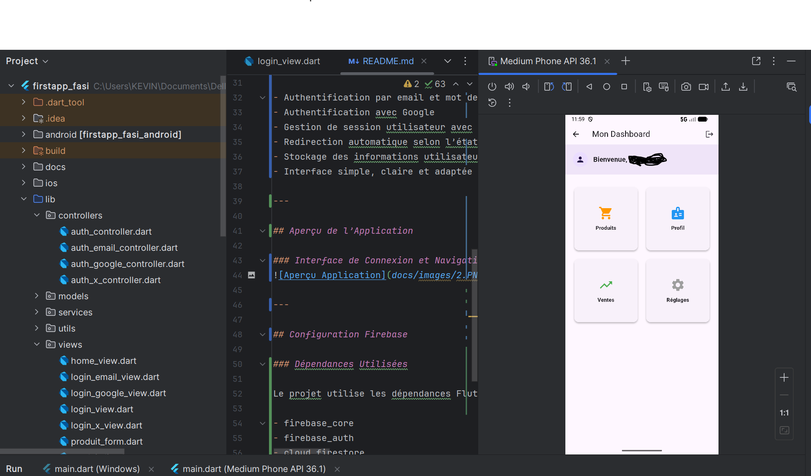

# FirstApp_fasi – TP Flutter Firebase Auth

FirstApp_fasi est une application Flutter réalisée dans le cadre d’un Travail Pratique.  
Elle implémente un système complet d’authentification utilisateur en utilisant Firebase Authentication et Cloud Firestore.

Le projet met l’accent sur la clarté du code, la séparation des responsabilités et le respect des bonnes pratiques Flutter.

---

## Informations Générales

- Nom : Kevin Bitubisha Mbemba
- Filière : L4 LMD FASI/ INGENIERIE LOGICIEL
- Université Protestante au Congo
- Statut du projet : Travail terminé et validé

---

## Objectifs du TP Atteints

1. Inscription des utilisateurs avec email et mot de passe via Firebase Authentication.
2. Connexion sécurisée avec email et mot de passe.
3. Connexion avec Google (authentification fédérée).
4. Déconnexion de l’utilisateur et gestion correcte de la session.
5. Affichage du prénom de l’utilisateur connecté dans le menu principal.
6. Protection de l’accès aux pages réservées aux utilisateurs authentifiés.

---

## Fonctionnalités Implémentées

- Authentification par email et mot de passe
- Authentification avec Google
- Gestion de session utilisateur avec SharedPreferences
- Redirection automatique selon l’état d’authentification
- Stockage des informations utilisateur dans Cloud Firestore
- Interface simple, claire et adaptée au contexte académique

---

## Aperçu de l’Application

### Interface de Connexion et Navigation




---

## Configuration Firebase

### Dépendances Utilisées

Le projet utilise les dépendances Flutter suivantes :

- firebase_core
- firebase_auth
- cloud_firestore
- google_sign_in
- shared_preferences

Installation des dépendances :

```bash
flutter pub get
